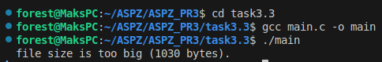
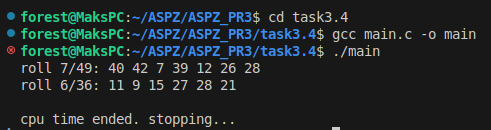

# Завдання 3.1

Запустіть Docker-контейнер і поекспериментуйте з максимальним лімітом ресурсів відкритих файлів. Для цього виконайте команди у вказаному порядку:

$ ulimit -n

$ ulimit -aS | grep "open files"

$ ulimit -aH | grep "open files"

$ ulimit -n 3000

$ ulimit -aS | grep "open files"

$ ulimit -aH | grep "open files"

$ ulimit -n 3001

$ ulimit -n 2000

$ ulimit -n

$ ulimit -aS | grep "open files"

$ ulimit -aH | grep "open files"

$ ulimit -n 3000
  
Як наступне вправу, повторіть перераховані команди з root-правами.

## Рішення

#### У цьому завдані я запускав Docker контейнер й перевіряв його обмеження, а саме обмеження на кількість відкритих файлів за допомогою команди `ulimit -u`.

#### Перевіряли як ліміт за замовчуванням '1024' так і змінювали потім на '2000' потім '3000' та '3001'.

#### Далі для подільгої перевірки, було виконано ті ж самі дії, але з правами адміністратора, щоб перевірити ліміти.

# Завдання 3.3

Напишіть програму, що імітує кидання шестигранного кубика. Імітуйте кидки, результати записуйте у файл, для якого попередньо встановлено обмеження на його максимальний розмір (max file size). Коректно обробіть ситуацію перевищення ліміту.

## Рішення

#### У цьому завданні, я написав програму, що дає змогу імітувати кидки грального (6 сторонього) кубика, й кожну ітерацію записує у файл 'log.txt'. 

#### Також було зроблено обмеження на масимальний розмір файлу, й коли він переповниться, зупиняємо програму й виводимо цю помилку.

# Завдання 3.4

Напишіть програму, що імітує лотерею, вибираючи 7 різних цілих чисел у діапазоні від 1 до 49 і ще 6 з 36. Встановіть обмеження на час ЦП (max CPU time) і генеруйте результати вибору чисел (7 із 49, 6 із 36). Обробіть ситуацію, коли ліміт ресурсу вичерпано.

## Рішення

#### У цьому завданні, я написав програму, що фактично імітує лотерею, перший раз робимо для діапазону '7/49', а для другого '6/36'.

#### Також в програмі реалізовано обмеження на час процессора 'CPU', якщо він виконує програму занадто довго, отримуємо сигнал 'SIGXCPU', що обробляється у функції й відповідно виводить повідомлення.

#### Для цієї помилки було написано функцію для нескінченного додавання числа, щоб імітувати навантаження на процессор.

# Завдання 3.5

Напишіть програму для копіювання одного іменованого файлу в інший. Імена файлів передаються у вигляді аргументів.

Програма має:

- перевіряти, чи передано два аргументи, інакше виводити "Program need two arguments";

- перевіряти доступність першого файлу для читання, інакше виводити "Cannot open file .... for reading";

- перевіряти доступність другого файлу для запису, інакше виводити "Cannot open file .... for writing";

- обробляти ситуацію перевищення обмеження на розмір файлу.

## Рішення

#### У цій програмі спочатку перевіряється кількість переданих нам аргументів, якщо їх недостатньо, повертаємо помилку з повідомленням про це. 

#### Для цього програма відкривала файл для читання 'read.txt', та копіювала його вміст у файл 'write.txt'. Якщо файли не вдається відкрити повертається помилка.

#### Також, якщо при копіювання ліміт розміру файлу буде перебільшено, повернеться помилка.

# Завдання 3.6

Напишіть програму, що демонструє використання обмеження (max stack segment size). Підказка: рекурсивна програма активно використовує стек.

## Рішення

#### У цьому завданні для перевірки обмеження 'max stack segment size', я зробив рекурсивну програму, що постійно викликає себе й збільшує 'глибину'. Й відповідно при досягненні ліміту програма завершувалась.

# Особисте завдання '3 Варіант'

Написати програму, яка використовує багато пам'яті та перевірити обмеження (ulimit -v).

## Рішення

#### У цій програмі біло виділено 500мб пам'яті через 'malloc()'.

#### Далі програма перевіряє, чи вдалось виділити пам'ять, якщо ні повертає помилку. Якщо так, то заповнюємо для наглядності бідь який значенням в даному випадку 'а' й повертаємо повідомлення про успіх.

#### Для цієї перевірки також було викликано команду 'ulimit -v' зі значенням менше ніж було у програмі, й відповідно, в нас не вийшло виділити пам1ять через це.

